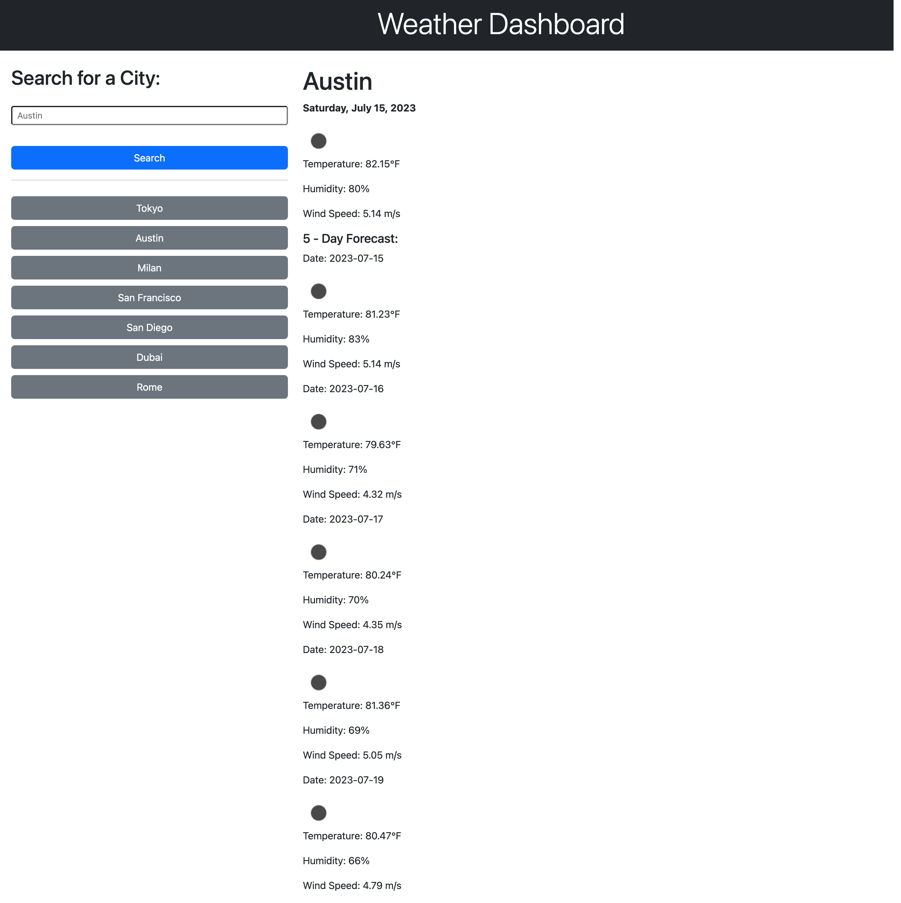

# weather-dashboard

## Description

The goal for this project was to create a weather dashboard that would display the current and a five-day forecast weather for the selected city. The name of the city, date, temperature, wind, humidity, and an icon that represents the weather condition are displayed.

The city that the user has selected is displayed on the right hand side, and these search results are saved under the search button, where it stucked under each other. When the user clicks on one of the previously selected cities, it will replace the current results.

## Technology Used

[JavaScript](!--https://developer.mozilla.org/en-US/docs/Web/JavaScript--)
[HTML](!--https://developer.mozilla.org/en-US/docs/Web/HTML--)
[CSS](!--https://developer.mozilla.org/en-US/docs/Web/CSS--)
[Git](!--https://git-scm.com--)
[Bootstrap](!--https://getbootstrap.com/docs/5.3/getting-started/introduction--)

## Learning points

- fetch
- classList.add
- temperature conversion
- toFixed()
- getCurrentDate
- toLocaleDateString
- Get icon URL
- innerHTML
- insertBefore

## Deployment

[Weather Dashboard](https://elenagurchinskaia.github.io/weather-dashboard/)

## Author

### Elena Gurchinskaia

- [LinkedIn](https://www.linkedin.com/in/elena-gurchinskaia-4969ab104/)
- [Github](https://github.com/elenagurchinskaia/)

## License

N/A
